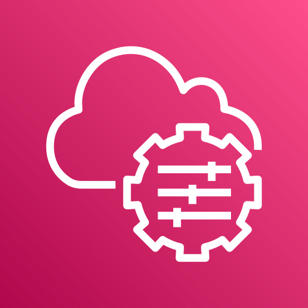
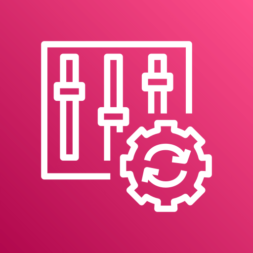

## Terraform AWS DevSecOps ThreatResponse Pipeline 

An enterprise-grade, Terraform-powered DevSecOps framework for orchestrating real-time threat detection, policy enforcement, and automated remediation across AWS environments.

> Designed as a modular, event-driven SOAR-lite solution leveraging native AWS services, it enables scalable, auditable, and fully code-driven cloud security operations.

<p align="center">
  
  &nbsp;&nbsp;&nbsp;
  
</p>


## Tech Stack & Security Focus
<!-- BADGES START -->
[](https://www.terraform.io/)
[](https://aws.amazon.com/)
[]()
[]()

[]()
[]()
[]()
<!-- BADGES END -->

## Services and AWS Tools Used
> Infrastructure-as-Code, Identity, Monitoring, Detection & Automated Response — all under one event-driven pipeline.</sup>

<table align="center">
<tr align="center">
  <td align="center">
    <br/>
    <sub><b>Terraform</b></sub>
  </td>
  <td align="center">
    <br/>
    <sub><b>IAM</b></sub>
  </td>
  <td align="center">
    <br/>
    <sub><b>SSM</b></sub>
  </td>
  <td align="center">
    <br/>
    <sub><b>VPC</b></sub>
  </td>
  <td align="center">
    <br/>
    <sub><b>CloudShell</b></sub>
  </td>
  <td align="center">
    <br/>
    <sub><b>Chatbot</b></sub>
  </td>
  <td align="center">
    <br/>
    <sub><b>Config</b></sub>
  </td>
</tr>

<tr align="center">
  <td align="center">
    <br/>
    <sub><b>GuardDuty</b></sub>
  </td>
  <td align="center">
    <br/>
    <sub><b>Inspector</b></sub>
  </td>
  <td align="center">
    <br/>
    <sub><b>Lambda</b></sub>
  </td>
  <td align="center">
    <br/>
    <sub><b>EventBridge</b></sub>
  </td>
  <td align="center">
    <br/>
    <sub><b>SNS</b></sub>
  </td>
  <td align="center">
    <br/>
    <sub><b>CloudWatch</b></sub>
  </td>
  <td align="center">
    <br/>
    <sub><b>CloudTrail</b></sub>
  </td>
</tr>
</table>

## Architecture Overview

<p align="center">
  
  <br/>
  <sub><i>Terraform-based SOAR-lite architecture: native AWS services for detection, alerting, and remediation.</i></sub>
</p>

## DevSecOps Execution Pipeline (Phase-wise Breakdown)

| Phase No. | Title                             | Implementation Steps                                                                                   |
|-----------|-----------------------------------|---------------------------------------------------------------------------------------------------------|
| Phase 1   | IAM Foundation                    | - Created IAM roles for Lambda, EC2 (SSM), and Inspector<br>- Applied scoped inline policies<br>- Enforced MFA via IAM policy<br>- Enabled IAM Access Analyzer to detect public access |
| Phase 2   | Secure Network Deployment         | - Provisioned custom VPC with public/private subnets<br>- Attached IGW and NAT Gateway<br>- Defined NACLs to block SSH/RDP<br>- Enabled VPC Flow Logs for traffic inspection |
| Phase 3   | Misconfiguration Detection & Remediation | - Enabled AWS Config with managed rule for S3PublicRead<br>- Created Lambda to delete public bucket policies<br>- Integrated GuardDuty and Inspector<br>- Automated remediation with Lambda functions |
| Phase 4   | Event-Driven SOAR-Lite            | - Configured EventBridge rules for GuardDuty and Inspector findings<br>- Linked each rule to corresponding Lambda handler<br>- Published alerts and actions to SNS topics |
| Phase 5   | Real-Time Alerts                  | - Set up SNS topics with email and Slack subscriptions<br>- Integrated AWS Chatbot with Slack workspace<br>- Pushed alerts from Lambda/EventBridge via SNS |
| Phase 6   | CloudWatch Intrusion Detection    | - Enabled CloudTrail logging<br>- Created Metric Filter for Unauthorized API calls<br>- Set CloudWatch Alarm for suspicious activity<br>- Triggered SNS alerts on alarm breach |

## Security Principles Applied

- **Least Privilege:** All IAM roles scoped to specific service actions.
- **Event-Driven Architecture:** Real-time response without polling.
- **Zero Trust Network:** No SSH/RDP access to EC2; VPC NACLs block direct ingress.
- **Auditable Remediation:** Config + Lambda logs all actions to CloudWatch.

## Repo Structure
<details>
  <summary><b>Repo Structure</b></summary>

```plaintext
terraform-aws-devsecops-autoresponse-pipeline/
├── 01-architecture/
│   └── architecture-iac.jpg
│
├── 02-scripts/
│   ├── phase-1-aws-config-s3-auto-remediation.tf
│   ├── phase-2-secure-vpc-private-ec2-ssm.tf
│   ├── phase-3-eventbridge-remediation-on-config.tf
│   ├── phase-4-6-soar-lite-gd-inspector-cloudwatch.tf
│   └── phase-5-chatbot-slack-alerts.txt
│
├── 03-screenshots/
│   ├── phase-1-aws-config-s3-auto-remediation/
│   ├── phase-2-secure-vpc-private-ec2-ssm/
│   ├── phase-3-eventbridge-remediation-on-config/
│   ├── phase-4-soar-lite-guardduty-inspector/
│   ├── phase-5-chatbot-slack-alerts/
│   └── phase-6-cloudwatch-unauthorized-api-alarms/
│
├── 04-assets/
│   ├── aws-chatbot.jpg
│   ├── cloudshell.png
│   ├── cloudtrail.png
│   ├── cloudwatch.png
│   ├── config.png
│   ├── eventbridge.png
│   ├── guardduty.png
│   ├── iam-identity-center.png
│   ├── inspector.png
│   ├── lambda.png
│   ├── sns.png
│   ├── systems-manager.png
│   ├── terraform.jpg
│   └── virtual-private-cloud.png

```
</details>

## Built By

Noufa Sunkesula

Email ID: noufasunkesula@gmail.com

Contact: +91 8106859686

Feel Free To Reach Out!
